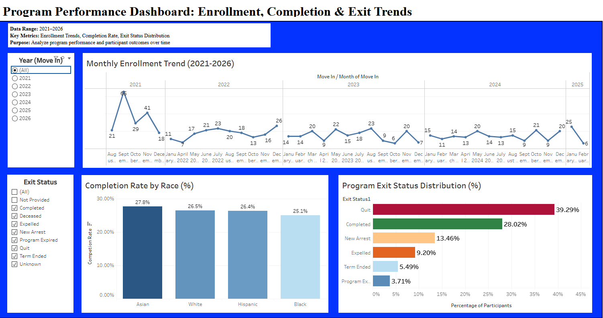

# 📊 Program Performance & Participant Outcomes Analysis  

## 📑 Table of Contents  
- [Overview](#overview)  
- [Business Problem](#business-problem)  
- [Dataset](#dataset)  
- [Analysis & Insights](#analysis--insights)  
- [Dashboard](#dashboard)  
- [Recommendations](#recommendations)  
- [Conclusion](#conclusion)  
- [Tools Used](#tools-used)  
- [Author](#author)  

---

## 📌 Overview  
This project analyzes program performance using participant data to evaluate enrollment trends, completion rates, and exit outcomes from 2021 to 2026. The goal is to identify opportunities to improve participant retention and overall program success.

---

## 🎯 Business Problem  
This analysis aims to answer the following questions:

- Are participants successfully completing the program?  
- What are the most common exit outcomes?  
- Are there differences in outcomes across participant groups?  
- Are there signs of retention challenges?  

---

## 📁 Dataset  
Two datasets were used:

- **Enrollment data** (participant demographics and move-in dates)  
- **Exit status data** (program outcomes)  

Both datasets were combined using a common participant ID.

---

## 📊 Analysis & Insights  

### 🔹 Exit Outcomes  
- **Quit is the most common exit (~39%)**, indicating significant retention challenges  
- **Completion rate remains low (~28%)**, highlighting the need for improved retention strategies  

---

### 🔹 Completion Rate by Race  
- Asian: ~27.8% (highest)  
- White & Hispanic: ~26%  
- Black: ~25%  

👉 **Differences across groups are relatively small, indicating broadly similar outcomes**

---

### 🔹 Enrollment Trends  
- Enrollment fluctuates over time  
👉 **Suggests inconsistent participant intake and potential operational variability**

---

## 📊 Dashboard  
An interactive Tableau dashboard was developed to visualize program performance:

- Monthly enrollment trends  
- Completion rates across participant groups  
- Distribution of exit outcomes  

🔗 **[View Interactive Dashboard](https://public.tableau.com/views/project_17768021043000/Dashboard1?:language=en-US&publish=yes&:sid=&:display_count=n&:origin=viz_share_link)**  

---

## 💡 Recommendations  

- **Strengthen retention strategies** to reduce early exits, particularly quit cases  
- **Identify and support at-risk participants earlier** in the program lifecycle  
- **Monitor completion rate as a key performance indicator (KPI)**  
- **Investigate root causes of high quit rates** to inform targeted interventions  

---

## 🧾 Conclusion  
Although enrollment remains relatively stable, **completion rates remain low (~28%)**, and a significant proportion of participants exit the program early—primarily due to quitting (~39%).  

These findings highlight the need for improved retention strategies, earlier participant support, and deeper analysis of exit behavior to enhance overall program outcomes.

---

## 🛠 Tools Used  
- Tableau Public  
- Excel (Pivot Tables)  

